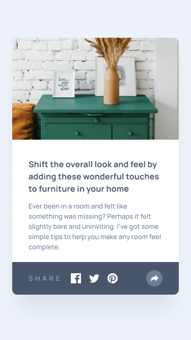
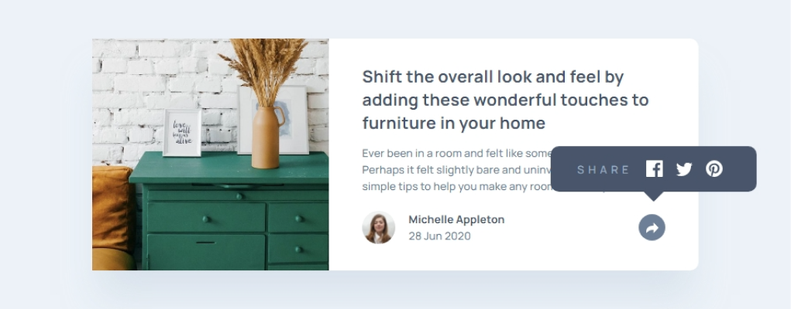

# Frontend Mentor - Article preview component solution

This is a solution to the [Article preview component challenge on Frontend Mentor](https://www.frontendmentor.io/challenges/article-preview-component-dYBN_pYFT). Frontend Mentor challenges help you improve your coding skills by building realistic projects.

## Table of contents

- [Frontend Mentor - Article preview component solution](#frontend-mentor---article-preview-component-solution)
  - [Overview](#overview)
    - [The challenge](#the-challenge)
    - [Screenshot](#screenshot)
    - [Links](#links)
  - [My process](#my-process)
    - [Built with](#built-with)
    - [What I learned](#what-i-learned)
    - [Useful resources](#useful-resources)
  - [Author](#author)

## Overview

### The challenge

Users should be able to:

- View the optimal layout for the component depending on their device's screen size
- See the social media share links when they click the share icon

### Screenshot

### Links

- Solution URL: [Frontend Mentor](https://www.frontendmentor.io/solutions/article-preview-component-6QPPOwbkeq)
- Live Site URL: [Preview](https://diogoluxa.github.io/frontend-mentor-article/)

## My process

### Built with

- Semantic HTML5 markup
- CSS custom properties
- Flexbox
- Mobile-first workflow
- [Sass](https://sasscss.org/) - Website

### What I learned

The biggest challenge was creating the social media sharing element that looked good on both mobile and desktop.

### Useful resources

- [The 7-1 Pattern](https://www.educative.io/courses/sass-for-css/the-7-1-pattern) - This article helped me a lot to organize my Sass folders.

## Author

- Website - [Diogo Luxa](https://dlxagency.online/)
- Frontend Mentor - [@DiogoLuxa](https://www.frontendmentor.io/profile/DiogoLuxa)
- Twitter - [@DiogoLuxa](https://twitter.com/DiogoLuxa)
